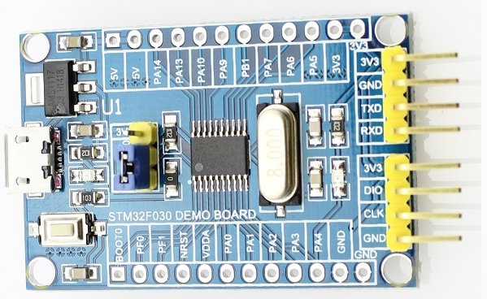
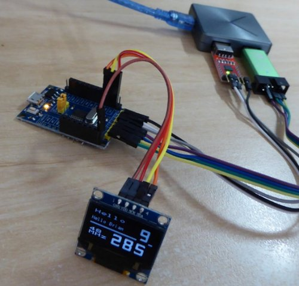
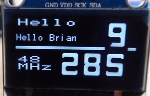
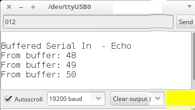

# STM32F030F4P6-Arduino

THIS IS NOT AN OFFICIAL STM32/ARDUINO PROJECT

This is an __interim project__ 
for getting the STM32F030F4P6 Cortex-M0 "Minimum System Dev" or "Demo" board 
up and running on Arduino IDE.  eBay and AliExpress are flooded with these for $2.  This may be a 32-bit chip at 48MHz, but it is the baby of the STM32 line.

I expect that the STM arduino project may shortly release 
support for this chip, in which case then use the official version, of course.  

In any case, the library modules in this project should still be valid on an official support version.

## Programming?

The USB micro connector is for 5V power only, not USB data. (The chip does not support USB!)

The easiest practical programming method is Upload Method = "STLink".
**Get one** ($3). Check elsewhere if you need any config/setup help. 
Get it running for your scenario, and programming becomes trivially easy thereafter. Simply leave the BOOT0 jumper always on the GND side.

__No flash bootloader is used or needed__. (And that's a whole other hassle out of the way!)

And get a 3V TTL USB serial adapter (CP2102 and CH340 are 3V) while you are at it ($1.5). You are going to need that for "terminal", at least.

But, alternative to STLink, you __can__ use the (ROM-based and undestroyable) factory flashing function using PA9/PA10 (ie TX/RX) and the serial adapter (TX-to-RX and RX-to-TX remember). Upload Method = "Serial". Press reset with boot0 jumper to 3V, upload with IDE, restart with boot0 to GND, and your sketch should run.

## Libraries Included Here:

The F030F4 has only 16K of flash. Compiling the arduino IDE with an empty sketch will use about 8K. 
However, including calls in your sketch to arduino's regular __Serial__ will also add __many K__ to the build size, abruptly passing the 16k limit. One Serial.println(int) and you've used 15.5k! Yes, that one-liner just works - on PA2/PA3, note this, not PA9/PA10 - but your sketch now has no code space left.

And the __Wire__ pin assignments conflict with the uart header use, as built.

The most obvious implication is that we now have no easy way to "view" any output, even any debug information,
beyond toggling a LED!  (No serial terminal. It's not connected at USB connector. 
And the native Serial software is too big.)

There are some new very lightweight arduino libraries included here, so that we now **can** communicate 
with the F030F4. We can run a "Serial" on its uart header, we can run an oled display, and we can use Wire/I2C on pins of our choice. These libraries (with example files) are:

 - __miniSerial__ - a simple software non-interrupt low-performance duplex serial driver, max 19200. 
      So now a terminal can be used with your sketch. TXD/RXD ie PA9/PA10, ie at the correct uart header, 
      but is also pin configurable if needed.
      Syntax is an approximate subset of regular native Serial. 
      Some miniSerial info:  https://github.com/BLavery/miniSerial
 - __miniOled__ - a lean and basic driver for the ubiquitous '0.96" I2C SSD1306 Oled' display. 
      Optionally using I2C writes via SoftWire (allowing pin choice), or native HAL I2C on PA9 PA10.
      So now we can see some display output. 
      Derived out of Daniel Turton's OzOled project 2014/2015. 
      To use the optional software I2C, you need to also fetch and install other-party libraries SoftWire and AsyncDelay. 
      Some miniOled info: https://github.com/BLavery/miniOled

Quality = working, if not elegant. 
Code size = comfortable in our tiny flash space.
The library code is intentionally minimal - just enough to get the job done, of being able to "talk"
to this board, leaving code space still available for a modest sketch. 

Other Libraries, needed for miniOled to run on pins other than PA9 PA10:
 - __SoftWire__ 2.0 from here: https://www.arduinolibraries.info/libraries/soft-wire
 - __AsyncDelay__ (used by SoftWire) from here: https://github.com/stevemarple/AsyncDelay

(And incidentally, SoftWire should be equally useable with other I2C libraries or devices on the '030F4P6.
For example, there is an instruction note in libraries folder on adapting alternative ACROBOTIC oled library for SoftWire.)

## Installation:

1. You must install the STM32 core (official) board support from here:
   https://github.com/arduino/Arduino/wiki/Unofficial-list-of-3rd-party-boards-support-urls#list-of-3rd-party-boards-support-urls
   If you have an earlier version than 1.4, then upgrade it to 1.4.  (1.4 is current as at this date 7 Nov.)

2. Find your install location for the STM32 package (mine on Mint was /opt/Arduino1.8.5/portable/packages/STM32/hardware/STM32/1.4.0/
but yours will be doubtless a bit different. Hunt for a bunch of "variant.h" files and then check
you are indeed in the STM32 region. On my Windows install I found the files here:  C:\Users\Brian\AppData\Local\Arduino15\packages\STM32\hardware\stm32\1.4.0\

a. inside the .../1.4.0/variants/ folder, add the DEMO-F030F4 folder from here, with its 5 files. (Now - 12 Nov - aligned with coming V1.5.)

b. in the .../1.4.0/ folder, open the existing boards.txt in an editor, and patch in the GenF030 "excerpt" section.

3. Find your user sketchbook folder ("(documents).../Arduino/" probably, but File/Preferences in your IDE should tell you).
In its libraries folder, add the libraries supplied here, and the SoftWire & AsyncDelay ones too if needed.

## Digital pin numbering: 

(Revised 12 Nov)

In your sketch, pins can be referenced by any of (for LED, for example) PA4,  D4  or just 4. I find using PA4 style to be intuitive as it agrees with the board markings.

  PA0  D0 
  
  PA1  D1 
  
  PA2  D2  
  
  PA3  D3  
  
  PA4  D4  = On-board LED
  
  PA5  D5  
  
  PA6  D6  
  
  PA7  D7  
  
  PB1  D8  
  
  PA9  D9  = UART Header "TX" 
  
  PA10 D10 = UART Header "RX" 
  
  PA13 D11 - SWDIO  = STlink Header "DIO"
  
  PA14 D12 - SWCLK  = STlink header "CLK"
  

## Analog pins: 

(Revised 12 Nov)

A0	~ PA0

A1	~ PA1

A2	~ PA2

A3	~ PA3

A4	~ PA4

A5	~ PA5

A6	~ PA6

A7	~ PA7

A8	~ PB1

	
## Wiring Hint:

In the second pic above showing USB Serial adapter and (clone) STLink, with BOTH CONNECTED AT ONE TIME, I leave off the +3V wire of the USB-Serial device. Otherwise the STM32 board gets 3V supply from 2 sources. Haven't tested it (!), but that sounds like a "BAD IDEA!"

Note the pic also shows no USB-micro connection to the STM32 board. That would be a THIRD voltage source in this case!   The moral: Whatever is your connection configuration, THINK about where your board supply is coming from. Use just one.

V. 0.3.0 13 Nov 2018

## Acknowledgement:

The above code for IDE support is now (12 Nov) the same as this (Adminius) version: 
    https://github.com/stm32duino/Arduino_Core_STM32/tree/master/variants/DEMO_F030F4 
(IE, Earlier version that was here has now been brought into line with forthcoming V1.5.) A couple of pin numberings have changed. 
    
The Installation parts 1 and 2 above will become obsolete/unnecessary here when 1.5 is released.
But the library files here (Installation part 3 above) will remain working and valid. 

The intention of this project here has been to get something up and running ASAP on this limited-capacity board. The board has been available "out there" now for a while. There will doubtless be in due course more elegant solutions to its limitations than the "mini" libraries above.  

But on second thought ... If it offends you to use simple workarounds for this chip's limited flash space, if you really need something that can load libraries and fit in more than some simple GPIO I/O, then spend another $1 and buy one of the various STM32F103C8T6 / bluepill boards with 4 times the flash.

__Related:__

For my notes on the 'F103 "BluePill", see https://github.com/BLavery/STM32F103-Arduino

For my notes on the 1024k STM32F407VG, see https://github.com/BLavery/STM32F407VG-Arduino
